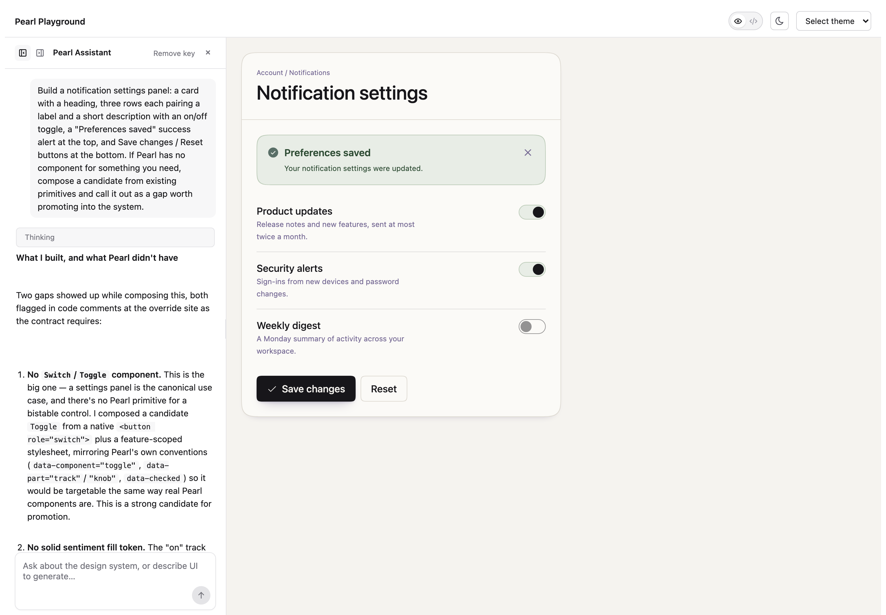

# Playground test run — 2026-08-31 · the Switch gap

**What was tested:** whether an uncoached generation run, given a common
product surface (a notification settings panel), would _surface a missing
component as a gap and compose a promotable candidate from primitives_ rather
than either inventing a `Switch` API that doesn't exist or silently degrading.



**Setup:** `pearl-playground` running against the packed tarball install (not a
source symlink), Pearl theme, single prompt to the in-browser assistant:

> Build a notification settings panel: a card with a heading, three rows each
> pairing a label and a short description with an on/off toggle, a "Preferences
> saved" success alert at the top, and Save changes / Reset buttons at the
> bottom. If Pearl has no component for something you need, compose a candidate
> from existing primitives and call it out as a gap worth promoting into the
> system.

The last sentence is the one bit of coaching — it invites the promotion
framing. Everything else about which components, tokens, and roles to use came
from the manifest / `llms.txt` shipped in `node_modules`.

**A note on what's captured here.** The assistant's reasoning below is verbatim
from the run in the screenshot. The playground keeps generated source only in
client state, so that exact run's code wasn't recoverable — the code block at
the end is from a re-run of the _identical_ prompt. The two runs made the same
structural decisions (a `<button role="switch">` candidate with its own
`data-component`, real sentiment tokens, flagged for promotion); only cosmetic
names differ between runs (`toggle` vs `switch-candidate`, `knob` vs `thumb`).

## Result: the gap was surfaced, not papered over

The assistant generated a single-render TSX component that rendered live with no
console errors: a `Card` with `Card.Header`/`Card.Body`, a dismissible
`Alert variant="positive"`, three label + description + toggle rows, and a
`Button` pair. The three toggles are interactive.

Its own summary, verbatim, led with **"What I built, and what Pearl didn't
have"**:

### 1. No Switch / Toggle component — composed a promotion candidate

> a settings panel is the canonical use case, and there's no Pearl primitive
> for a bistable control. I composed a candidate `Toggle` from a native
> `<button role="switch">` plus a feature-scoped stylesheet, mirroring Pearl's
> own conventions (`data-component="toggle"`, `data-part="track"`/`"knob"`,
> `data-checked`) so it would be targetable the same way real Pearl components
> are. **This is a strong candidate for promotion.**

This is the behaviour the run was checking for: the missing component is named
as a gap, the substitute is built to the system's _own_ override contract (so a
maintainer could adopt it with minimal reshaping), and it's explicitly flagged
for canonization rather than presented as if `Switch` were part of the API.

### 2. No solid sentiment fill token — named the right gap

> The "on" track reads pale because `color.positive.surface` is intentionally
> tinted at Alert intensity — that's the semantically correct sub-field for a
> background fill, and I did not reach for `color.positive.icon` as a
> substitute (wrong sub-field for a fill). But it means a checked toggle is
> quieter than most design systems' checked toggles. **The gap is the missing
> bold sentiment fill, not the missing component.**

It used the semantically-correct token and accepted the muted result, rather
than substituting a token that would have looked right but meant the wrong
thing — and it separated "the fill token is missing" from "the component is
missing" as two different gaps.

### 3. No Divider component — declined the luster treatment

> there's no Divider component either, so the row rules are plain 1px hairlines.
> I deliberately did not try to give them the `hairlineRule` luster treatment —
> that role is theme-owned, and only one lustered surface belongs in view at
> rest.

Correctly applied a non-obvious written constraint (single lustered surface at
rest) to a case the prompt never mentioned.

### Theme-conformant choices it called out

- The toggle's off state and knob use `currentColor` rather than a guessed
  neutral token — "Pearl's neutral color scale isn't in the documented manifest
  surface, and hand-typing a custom-property name would silently fail rather
  than error."
- `cardHover` luster on the card and `secondaryHover` on the secondary button;
  nothing animates at rest.
- Descriptions use `measure="sm"` so the two-column row keeps a readable line
  length as the panel widens.
- Noted that the inlined `<style>` block would be a `Feature.css.ts` using
  `style()` + the imported `color` object in a real codebase — the inline form
  is a sandbox limitation, not a recommendation.

## Weak spot / caveat

The promotion framing was invited by the prompt's last sentence. An unprompted
run (`2026-08-30-uncoached-generation-tests.md`) would be the cleaner test of
whether the assistant reaches for "flag it as a canonization candidate" on its
own, or just composes a substitute and moves on. What this run does show is
that when asked to, it composes the candidate _against the real override
contract_ rather than a generic pattern — which is the part that depends on the
manifest being accurate.

## Full generated code

From a re-run of the identical prompt (see the note near the top on why this
isn't byte-identical to the screenshotted render).

```tsx
const NotificationSettings = () => {
  const DEFAULTS = { product: true, security: true, digest: false };

  const items = [
    {
      id: 'product',
      label: 'Product updates',
      description: 'New features, improvements, and release notes.',
    },
    {
      id: 'security',
      label: 'Security alerts',
      description: 'Sign-ins from new devices and password changes.',
    },
    {
      id: 'digest',
      label: 'Weekly digest',
      description: 'A Monday summary of activity across your workspace.',
    },
  ];

  const [prefs, setPrefs] = React.useState(DEFAULTS);
  const [saved, setSaved] = React.useState(true);

  const toggle = (id) => {
    setPrefs((p) => ({ ...p, [id]: !p[id] }));
    setSaved(false);
  };

  return (
    <div style={{ maxWidth: 480 }}>
      {/*
        Candidate component: "Switch".
        Pearl ships no toggle/boolean-control component, so this is new markup
        (not an override of an existing Pearl component) — hence its own
        data-component name and its own feature stylesheet. Sentiment colors
        come from the real token objects, never hand-typed var() names.

        gap: the ON track uses color.positive.surface/border, which are the
        pale, alert-intensity tints. Pearl exposes no solid sentiment fill, so
        an "on" switch reads quieter than a filled control normally would.
      */}
      <style>{`
        [data-component="switch-candidate"] {
          appearance: none;
          flex: none;
          width: 44px;
          height: 26px;
          padding: 3px;
          border-radius: 999px;
          display: inline-flex;
          align-items: center;
          cursor: pointer;
          transition: background-color 120ms ease, border-color 120ms ease;
          background: color-mix(in srgb, currentColor 8%, transparent);
          border: 1px solid color-mix(in srgb, currentColor 28%, transparent);
        }
        [data-component="switch-candidate"][data-state="on"] {
          background: ${color.positive.surface};
          border-color: ${color.positive.border};
        }
        [data-component="switch-candidate"] [data-part="thumb"] {
          width: 18px;
          height: 18px;
          border-radius: 999px;
          transition: transform 120ms ease, background-color 120ms ease;
          transform: translateX(0);
          background: color-mix(in srgb, currentColor 45%, transparent);
        }
        [data-component="switch-candidate"][data-state="on"] [data-part="thumb"] {
          transform: translateX(18px);
          background: ${color.positive.icon};
        }
        [data-component="switch-candidate"]:focus-visible {
          outline: 2px solid ${color.info.icon};
          outline-offset: 2px;
        }
        .notif-row {
          display: flex;
          align-items: flex-start;
          justify-content: space-between;
          gap: 24px;
        }
        .notif-actions {
          display: flex;
          justify-content: flex-end;
          gap: 12px;
        }
      `}</style>

      <Card>
        <Card.Header>
          <Stack gap="xs">
            <Text role="preheading" prominence="subtle" as="p">
              Account / Notifications
            </Text>
            <Text typeScale="headingSm" as="h2">
              Notification settings
            </Text>
          </Stack>
        </Card.Header>

        <Card.Body>
          <Stack gap="lg">
            {saved && (
              <Alert
                variant="positive"
                heading="Preferences saved"
                onDismiss={() => setSaved(false)}
              >
                Your notification settings are up to date.
              </Alert>
            )}

            <Stack gap="md">
              {items.map((item) => (
                <div className="notif-row" key={item.id}>
                  <Stack gap="xs">
                    <Text
                      typeScale="bodyMd"
                      weight="medium"
                      as="label"
                      id={`${item.id}-label`}
                    >
                      {item.label}
                    </Text>
                    <Text
                      typeScale="bodySm"
                      prominence="subtle"
                      measure="sm"
                      as="p"
                    >
                      {item.description}
                    </Text>
                  </Stack>

                  <button
                    type="button"
                    role="switch"
                    aria-checked={prefs[item.id]}
                    aria-labelledby={`${item.id}-label`}
                    data-component="switch-candidate"
                    data-state={prefs[item.id] ? 'on' : 'off'}
                    onClick={() => toggle(item.id)}
                  >
                    <span data-part="thumb" />
                  </button>
                </div>
              ))}
            </Stack>

            <div className="notif-actions">
              <Button
                variant="secondary"
                onClick={() => {
                  setPrefs(DEFAULTS);
                  setSaved(false);
                }}
              >
                Reset
              </Button>
              <Button variant="primary" onClick={() => setSaved(true)}>
                <Icon icon={PiCheck} size={16} />
                Save changes
              </Button>
            </div>
          </Stack>
        </Card.Body>
      </Card>
    </div>
  );
};

render(<NotificationSettings />);
```

## Takeaway

For this prompt, the manifest carried enough of Pearl's override contract and
token semantics that the assistant could turn a missing component into a
concrete, adoptable proposal — `data-component`/`data-part` attributes and all —
and could tell the difference between a missing component and a missing token.
The `Switch`/`Toggle` gap this surfaced is real and tracked; if it graduates,
this run is part of the paper trail for why.
