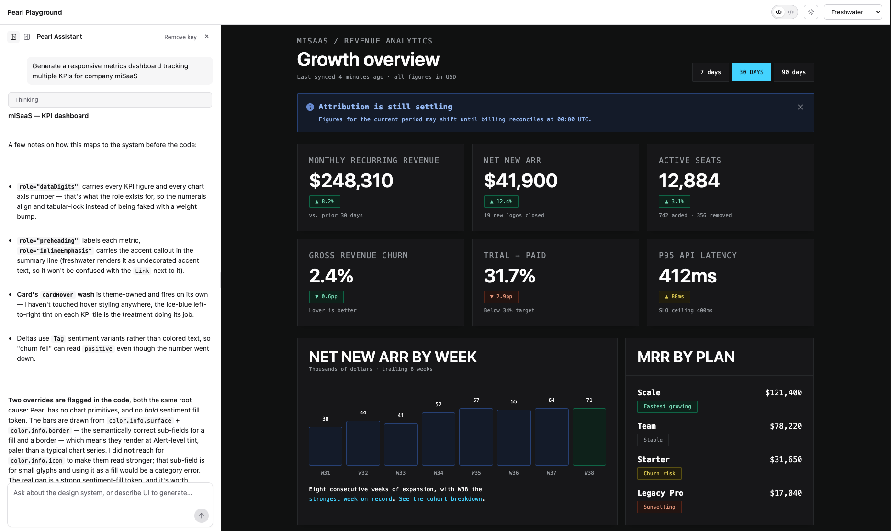

# Playground test run — 2026-09-01 · the KPI dashboard

**What was tested:** two things at once — whether an uncoached generation run
would surface Pearl's real gaps (chart primitives, a bold sentiment fill
token) instead of papering over them on a data-heavy surface it's never been
asked for before, and (separately) whether `toDisplaySnippets` — a new
display-only transform in `pearl-playground` — could turn that sandbox-only
code into the `Feature.css.ts` + `Feature.tsx` pair a developer would actually
paste into a real Pearl codebase, without silently emitting broken code.



**Setup:** `pearl-playground` running against the published `@msanagu/pearl@0.4.0`
registry package, Freshwater theme, single prompt to the in-browser assistant:

> Generate a responsive metrics dashboard tracking multiple KPIs for company
> miSaaS

No coaching beyond that one line — no mention of charts, tokens, or gaps to
flag.

## Result: the assistant named both real gaps, unprompted

The generated component rendered live with no console errors: a header with
range controls, a dismissible `Alert`, an 8-card responsive KPI grid, a
12-week bar chart, and a seats-by-plan panel. Its own summary led with two
named limitations, not a generic "here's your dashboard":

### 1. No chart primitive — named as a layout hole, not a styling one

The signups chart is hand-built: a flex row of columns, each a `div` whose
`height` is set inline per bar (`style={{ height: `${Math.round((v / peak) *
100)}%` }}`) — correctly treated as **data geometry**, not a visual override,
with a code comment saying exactly that: `/* geometry only — height is data,
never a visual token */`.

### 2. No bold sentiment fill — named the correct sub-field, not a workaround

The bars are built from `color.info.surface` (fill) and `color.info.border`
(border) — the semantically correct sub-fields — rather than reaching for
`color.info.icon` to fake a stronger look. The peak bar switches to
`color.positive.surface`/`border` via a `data-peak="true"` attribute selector,
not a hand-picked "brighter" color. The component's own comment states the
consequence plainly: this means the chart renders at "pale, alert-strength
tint rather than a saturated data-viz fill" — the same gap the manifest has no
token for, named without being asked to.

### Theme-conformant choices it made unprompted

- KPI figures and the chart's peak-week count use `role="dataDigits"`; row
  labels use `role="preheading"`.
- Deltas render as `Tag` sentiment variants (`positive`/`negative`/`warn`),
  never colored text.
- The responsive grid (1 → 2 → 4 KPI columns at 640px/1024px, panels stacking
  until 1024px) is plain CSS grid + media queries — correctly kept out of any
  Pearl component's own styling, since Pearl ships no grid primitive.
- One selector it wrote — `.misaas-kpi-grid > * { height: 100%; }` — a
  child-combinator rule the transform below doesn't support; it's preserved
  as a comment in the generated `.css.ts` rather than silently dropped.

## The other thing this run tested: `toDisplaySnippets`

The sandbox's live-eval code (react-live, no imports, inline `<style>`,
required so `render(...)` can execute — see `systemPrompt.ts`'s "Generation
format") never changes. What's new is what the Code tab now *shows*: a
best-effort transform that reshapes that sandbox code into what you'd
actually commit — real imports, and a vanilla-extract `.css.ts` file instead
of an inline `<style>` block, since `style()` only runs inside a `.css.ts`
(its Vite plugin extracts it at build time — there's no single-file version
of this).

Two bugs surfaced by running it against this exact output, both fixed before
this doc was written:

- **A plain string got mistaken for a component import.** One plan's tag text
  was the literal word `'Pipeline'` — the icon-detection regex matched it as
  if it were `PiSomething` from `react-icons/pi` and emitted a bogus import.
  Fixed by requiring PascalCase immediately after `Pi` (react-icons' own
  naming convention), which a lowercase continuation like `Pipeline` fails.
- **A CSS comment (`/* chart geometry */`) broke the block parser**, which had
  no comment awareness and folded the comment text into the next selector.
  Fixed by stripping `/* ... */` before parsing.

The transform also guards against a third failure mode, exercised in testing
rather than by this specific run: a `.css.ts` file runs at module scope, so it
can reference the static token objects (`color`, `space`, `radius`,
`fontFamily`, `fontWeight`, `controlHeight`) but not a component-local
variable or prop, which only exists per-render. A declaration whose value
references anything outside that static set is excluded from `style()` and
left as a comment telling you to apply it via an inline `style` prop instead
— rather than emitting a `.css.ts` that would throw `ReferenceError` on an
undefined module-scope name.

## Full generated code

`Feature.css.ts`:

```ts
import { style } from '@vanilla-extract/css';
import { color } from '@msanagu/pearl';

export const misaasDash = style({
  width: '100%',
});

export const misaasHead = style({
  display: 'flex',
  flexWrap: 'wrap',
  alignItems: 'flex-end',
  justifyContent: 'space-between',
  gap: '16px',
});

export const misaasHeadActions = style({
  display: 'flex',
  flexWrap: 'wrap',
  gap: '8px',
});

export const misaasKpiGrid = style({
  display: 'grid',
  gridTemplateColumns: 'minmax(0, 1fr)',
  gap: '16px',
  '@media': {
    '(min-width: 640px)': {
      gridTemplateColumns: 'repeat(2, minmax(0, 1fr))',
    },
    '(min-width: 1024px)': {
      gridTemplateColumns: 'repeat(4, minmax(0, 1fr))',
    },
  },
});

export const misaasPanels = style({
  display: 'grid',
  gridTemplateColumns: 'minmax(0, 1fr)',
  gap: '16px',
  '@media': {
    '(min-width: 1024px)': {
      gridTemplateColumns: 'minmax(0, 2fr) minmax(0, 1fr)',
    },
  },
});

export const misaasChart = style({
  display: 'flex',
  alignItems: 'flex-end',
  gap: '6px',
  height: '148px',
});

export const misaasChartCol = style({
  flex: '1 1 0',
  minWidth: '0',
  display: 'flex',
  alignItems: 'flex-end',
  height: '100%',
});

export const misaasBar = style({
  width: '100%',
  borderRadius: '3px 3px 0 0',
  background: color.info.surface,
  border: `1px solid ${color.info.border}`,
  borderBottom: 'none',
  selectors: {
    '&[data-peak="true"]': {
      background: color.positive.surface,
      borderColor: color.positive.border,
    },
  },
});

export const misaasPlanRow = style({
  display: 'flex',
  alignItems: 'center',
  justifyContent: 'space-between',
  gap: '12px',
});

/* Not auto-converted — selector shape not recognized by this transform:
 * .misaas-kpi-grid > * {  height: 100%;  }
 */
```

`Feature.tsx`:

```tsx
import * as React from 'react';
import { PiArrowRight, PiCaretDown } from 'react-icons/pi';
import { Alert, Button, Card, Icon, Link, Row, Stack, Tag, Text, color } from '@msanagu/pearl';
import { misaasDash, misaasHead, misaasHeadActions, misaasKpiGrid, misaasPanels, misaasChart, misaasChartCol, misaasBar, misaasPlanRow } from './Feature.css';

const MiSaaSDashboard = () => {
  const [notice, setNotice] = React.useState(true);

  const kpis = [
    { label: 'Monthly recurring revenue', value: '$482,910', delta: '▲ 6.2%', tone: 'positive' },
    { label: 'Active workspaces', value: '3,148', delta: '▲ 114', tone: 'positive' },
    { label: 'Net revenue retention', value: '112%', delta: '▲ 3 pts', tone: 'positive' },
    { label: 'Trial → paid conversion', value: '24.8%', delta: '▼ 1.9 pts', tone: 'negative' },
    { label: 'Churned seats', value: '317', delta: '▲ 42', tone: 'negative' },
    { label: 'P95 API latency', value: '412 ms', delta: '▲ 88 ms', tone: 'warn' },
    { label: 'Support backlog', value: '61', delta: '▼ 12', tone: 'positive' },
    { label: 'Expansion ARR', value: '$96,400', delta: '▲ 11.4%', tone: 'positive' },
  ];

  const signups = [38, 44, 41, 52, 49, 63, 58, 71, 66, 80, 74, 92];
  const peak = Math.max(...signups);

  const plans = [
    { name: 'Scale', seats: '1,402 seats', share: '46%', tag: 'Growing', variant: 'positive' },
    { name: 'Team', seats: '1,010 seats', share: '32%', tag: 'Flat', variant: 'neutral' },
    { name: 'Starter', seats: '512 seats', share: '16%', tag: 'Declining', variant: 'negative' },
    { name: 'Enterprise', seats: '224 seats', share: '6%', tag: 'Pipeline', variant: 'info' },
  ];

  return (
    <div className={misaasDash}>
      {/*
        Feature-scoped stylesheet. Two things live here that Pearl does not cover:

        1. Responsive grid. Pearl ships Stack/Row but no documented grid or
           breakpoint primitive, so the KPI + panel layout is plain CSS with
           media queries. No color/border/background is set on any Pearl
           component here — layout only.

        2. override: the signups chart. Pearl has no chart component and no bold
           /solid sentiment fill token, so the bars use the semantically correct
           sub-fields — `surface` for the fill, `border` for the border — which
           means they render at pale, alert-strength tint rather than a saturated
           data-viz fill. Token objects are referenced as JS values, never
           hand-typed custom-property names.
      */}

      <Stack gap="lg">
        <div className={misaasHead}>
          <Stack gap="xs">
            <Text role="preheading" prominence="subtle" as="p">
              miSaaS · Growth
            </Text>
            <Text typeScale="headingMd" as="h1">
              Company metrics
            </Text>
            <Text typeScale="bodySm" prominence="subtle" as="p">
              Rolling 30 days · updated 14 minutes ago
            </Text>
          </Stack>

          <div className={misaasHeadActions}>
            <Button variant="secondary">
              Last 30 days
              <Icon icon={PiCaretDown} size={16} />
            </Button>
            <Button variant="primary">
              Export report
              <Icon icon={PiArrowRight} size={16} />
            </Button>
          </div>
        </div>

        {notice ? (
          <Alert
            variant="info"
            heading="Billing sync is catching up"
            onDismiss={() => setNotice(false)}
          >
            Revenue figures exclude invoices posted in the last hour. Seat and
            latency metrics are live.
          </Alert>
        ) : null}

        <div className={misaasKpiGrid}>
          {kpis.map((kpi) => (
            <Card key={kpi.label}>
              <Stack gap="sm">
                <Text role="preheading" prominence="subtle" as="p">
                  {kpi.label}
                </Text>
                <Text role="dataDigits" typeScale="headingMd" as="p">
                  {kpi.value}
                </Text>
                <Row gap="xs" wrap>
                  <Tag variant={kpi.tone}>{kpi.delta}</Tag>
                  <Text typeScale="caption" prominence="subtle" as="span">
                    vs. prior period
                  </Text>
                </Row>
              </Stack>
            </Card>
          ))}
        </div>

        <div className={misaasPanels}>
          <Card>
            <Card.Header>
              <Stack gap="xs">
                <Text typeScale="headingSm" as="h2">
                  Weekly signups
                </Text>
                <Text typeScale="bodySm" prominence="subtle" as="p">
                  Twelve weeks · peak of {peak} in the current week
                </Text>
              </Stack>
            </Card.Header>
            <Card.Body>
              <Stack gap="sm">
                <div className={misaasChart} role="img" aria-label={`Weekly signups, twelve weeks, from 38 to ${peak}`}>
                  {signups.map((v, i) => (
                    <div className={misaasChartCol} key={i}>
                      {/* geometry only — height is data, never a visual token */}
                      <div
                        className={misaasBar}
                        data-peak={v === peak ? 'true' : 'false'}
                        style={{ height: `${Math.round((v / peak) * 100)}%` }}
                      />
                    </div>
                  ))}
                </div>
                <Text typeScale="caption" prominence="subtle" as="p">
                  Signups are up{' '}
                  <Text as="span" role="inlineEmphasis">
                    142%
                  </Text>{' '}
                  since the self-serve onboarding change in week 4.
                </Text>
              </Stack>
            </Card.Body>
          </Card>

          <Card>
            <Card.Header>
              <Text typeScale="headingSm" as="h2">
                Seats by plan
              </Text>
            </Card.Header>
            <Card.Body>
              <Stack gap="md">
                {plans.map((plan) => (
                  <div className={misaasPlanRow} key={plan.name}>
                    <Stack gap="xs">
                      <Text typeScale="bodyMd" weight="semibold" as="p">
                        {plan.name}
                      </Text>
                      <Text typeScale="caption" prominence="subtle" as="p">
                        {plan.seats} · {plan.share} of base
                      </Text>
                    </Stack>
                    <Tag variant={plan.variant}>{plan.tag}</Tag>
                  </div>
                ))}
                <Text typeScale="bodySm" as="p" measure="sm">
                  Starter seats continue migrating upward.{' '}
                  <Link href="#">See the plan migration breakdown</Link>.
                </Text>
              </Stack>
            </Card.Body>
          </Card>
        </div>
      </Stack>
    </div>
  );
};

export default MiSaaSDashboard;
```

## Takeaway

Unprompted, on a surface (a data dashboard) the manifest has never explicitly
covered, the assistant still separated "missing component" from "missing
token" correctly, used the semantically right sub-field even though it looks
weaker, and treated a bar's height as data rather than styling. The
`toDisplaySnippets` transform this run also exercised is now what actually
ships in `pearl-playground`'s Code tab — the two bugs it surfaced (a string
literal mistaken for an icon import, a CSS comment breaking the parser) were
real and are fixed in `src/toDisplayCode.ts`, not just noted here.
