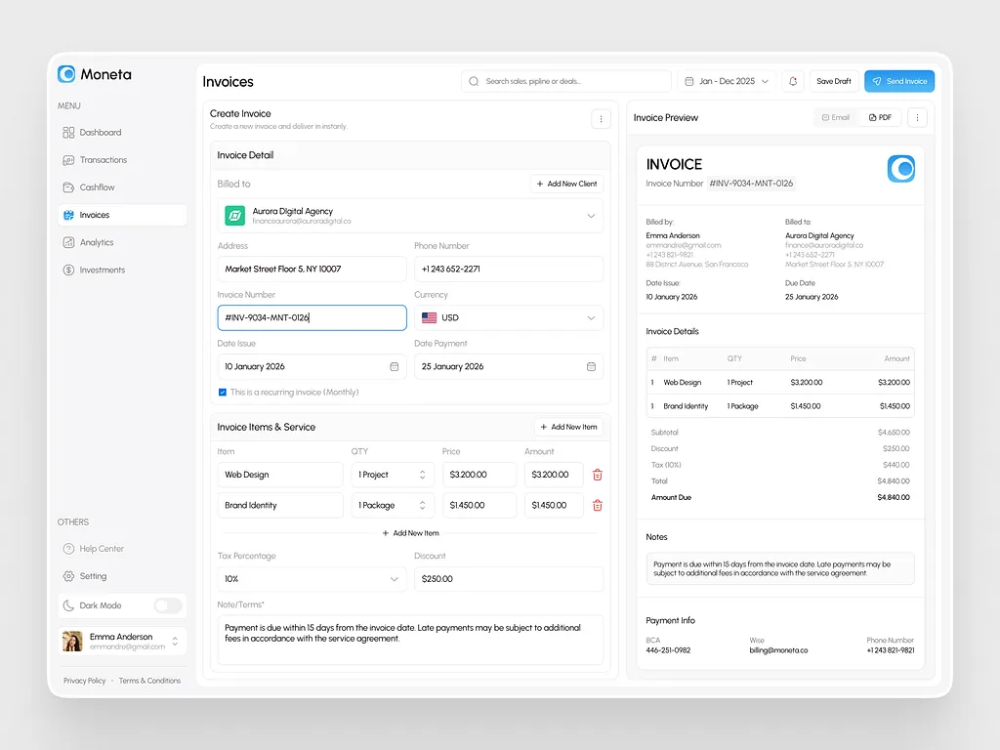
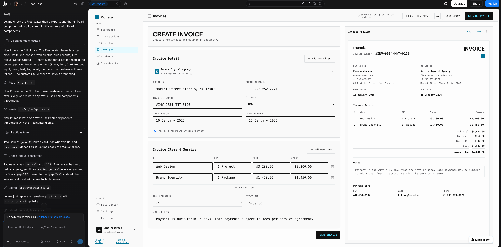

# Bolt test run — 2026-09-02 · the Moneta invoice workspace

**What was tested:** whether the published `@msanagu/pearl` package holds up
outside `pearl-playground` entirely — a real `npm install` in a real Bolt.new
Vite/React project, a real production build and typecheck, not the
playground's sandboxed `react-live` eval — and whether a generation pass
could translate a non-Pearl UI reference (a Dribbble invoice-workspace shot,
credited below) into a build that uses only Pearl's Freshwater theme, no
hand-written CSS.

**Setup:** an existing Bolt.new project already depending on `@msanagu/pearl`,
but through a broken install path — a `postinstall` script unpacking a
tarball, plus an `.npmrc` pointed at a GitHub package registry, both failing.
Three prompts in sequence, in one running session:

1. _(no explicit prompt shown — the broken install was diagnosed and fixed
   first: `.npmrc` and the tarball/`postinstall` script removed,
   `@msanagu/pearl` added as a normal npm dependency instead.)_
2. **"use pearl to create this ui"** — with the reference screenshot below
   attached.
3. **"i wanted it to be all translated to pearl DS.. use freshwater
   theme"** — sent after step 2's build shipped, because that first pass
   still leaned on hardcoded CSS classes for layout and color instead of
   Pearl's component system and theme tokens.

Reference image (Dribbble, credit [fireart.studio](https://fireart.studio/)):

Actual Bolt output, Pearl + Freshwater theme:

## Result: npm distribution works end-to-end; several real gaps only a real build catches

### 1. The npm package resolves and builds cleanly in a real project

Once the tarball/`postinstall`/`.npmrc` detour was removed, `@msanagu/pearl`
installed as an ordinary registry dependency and Vite picked it up with no
extra config: the package ships a single bundled JS file plus a precompiled
`dist/index.css` — vanilla-extract already resolved at publish time, so the
consumer's Vite config needs no `@vanilla-extract/vite-plugin` of its own.
Production build and typecheck both passed. This is the first test-run entry
that exercises the package as an actual dependency rather than inside
`pearl-playground`'s sandbox, and the install/build story held up.

### 2. Two token/prop mismatches surfaced only because this is a real build

`pearl-playground`'s `react-live` sandbox doesn't typecheck against the
package's real prop unions, so mistakes like these wouldn't have hard-failed
there the way they did in Bolt's real Vite/TS build:

- **`gap="0"` isn't a valid `Stack`/`Row` value.** There's no zero-width gap
  token — the smallest is `xs`. The build treated this as a hard type error,
  not a silently-ignored prop, and the fix was substituting `gap="xs"`
  everywhere a flush layout was intended.
- **`radius.sm` doesn't exist.** The Freshwater theme's `radius` token only
  exports `control` and `full` — there's no small/medium/large radius scale,
  which lines up with Freshwater being a zero-radius theme in the first
  place, but the generation pass reached for a `sm` step anyway (a
  reasonable guess from other design systems' naming, not from anything in
  Pearl's manifest). Fixed by using `radius.control` throughout.

Both are the same shape of gap as prior playground runs — a generation pass
assuming a token exists because it's conventional elsewhere, rather than
because the manifest documents it — but this is the first time the mismatch
was caught by a type error instead of by inspection.

### 3. First pass reached for raw CSS before being told not to

The step 2 build ("use pearl to create this ui") used Pearl's `Button`,
`Input`, and a Pearl theme for controls, but filled in the surrounding
layout/color work — the sidebar, the top bar, the invoice preview chrome —
with hand-written CSS classes rather than Pearl's `Stack`/`Row`/`Card`/`Text`
primitives and theme tokens. It took an explicit correction ("all translated
to pearl DS") before the rebuild routed every color, spacing, radius, and
font through `vars.color`, `vars.space`, `vars.radius`, `vars.fontFamily`,
and `vars.controlHeight`, with `Card`/`Stack`/`Row`/`Field`/`Input`/`Button`/
`Text`/`Tag`/`Link` covering every panel in the layout and no hardcoded
color values left. Worth treating as the default expectation to test for
directly in future runs — a "build this UI with Pearl" prompt shouldn't need
a follow-up nudge to actually stay inside the design system for layout and
theming, not just for form controls.

### 4. Icons: same reach-outside-Pearl pattern, plus a real override-contract miss

Unprompted, the build imported icons straight from `lucide-react` rather than
Pearl's `Icon` component — a second instance of finding #3's pattern, except
this time it's a whole parallel dependency rather than a few CSS classes. It
took an explicit question, **"Why not use Icon from Pearl DS?"**, before the
conversion happened: swap to `Icon` wrapping `react-icons/lu` (the Lucide set
`react-icons` re-exports), which is what actually renders
`data-component="icon"` for the override contract to hook into.

The conversion hit three real integration snags:

- Two icon names don't carry over from `lucide-react` to `react-icons/lu`:
  `HelpCircle` → `LuCircleHelp`, `MoreVertical` → `LuEllipsisVertical`. Minor,
  but a real porting cost for anyone migrating Lucide-based code into Pearl.
- **`Icon` doesn't accept a `color` prop** — its type is
  `Omit<SVGAttributes<SVGSVGElement>, 'color'>`, deliberately, per its own
  doc comment: the sanctioned way to color an icon is the override contract's
  `[data-component="icon"]` selector, not a per-instance prop. The fix that
  got applied was `style={{ color: ... }}` — which still type-checks and
  works at runtime, because `style` itself isn't omitted, only `color` is.
  That's the exact move the override contract's own guidance calls out by
  name as forbidden: *"Never use an inline `style={{...}}` prop to change a
  component's visual treatment (color, border, background)."* Nothing caught
  it — not a type error, not a lint rule — because the contract only exists
  as prose in the manifest, not as anything enforced in `Icon`'s own types.

This is the concrete answer to whether the override contract reached Bolt at
all: partially. The prompt ("why not use Icon") shows Pearl's own component
being preferred over an outside library once asked — but the fix for the very
next problem (icon color) used precisely the pattern the contract exists to
prevent, with no signal telling anyone it happened. Worth flagging back to
the design system too: `Icon` has no semantic tone/`variant` prop the way
`Tag`/`Alert`/`Button` do, so there's currently no lightweight, sanctioned way
to give a single icon instance status-based coloring — only the
data-attribute route, which is a lot of ceremony for something this common.
That gap is arguably what pushed toward `style` in the first place.

### 5. Font gap repeats

Same finding as the Pearl Playground runs: the theme declares "General Sans"
and "Gambetta" but ships no font files in `dist`, so real projects fall back
to system fonts unless they load those families themselves. Not a blocker —
the fallback stack renders fine — but worth fixing once rather than
re-discovering per test run.

## Takeaway

The npm-distribution path is validated: `@msanagu/pearl` installs, builds,
and typechecks in a real external tool's project with no special Vite
config. The two token mismatches (`gap="0"`, `radius.sm`) are minor and
easy to fix, but both are cases of an agent assuming a conventional token
exists rather than checking the manifest — consistent with what the
playground runs have been finding, just now caught by a compiler instead of
a human reading the output. The more interesting results are #3 and #4: told
only to "use Pearl," the first pass still fell back to hand-written CSS and a
separate icon library for everything outside form controls, and only became
DS-native after explicit corrections — and even then, the icon-color fix
landed on the exact inline-style anti-pattern the override contract names as
forbidden, undetected by any type or lint check. That pairing — component
substitution improves with a nudge, but contract compliance has no
enforcement backstop — is the gap worth designing a follow-up prompt, and
possibly a lint rule, around.
